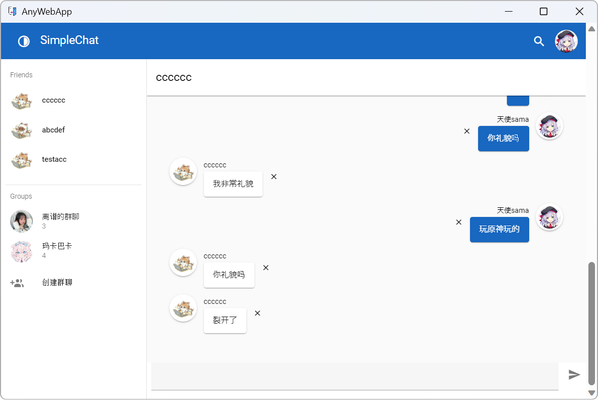

# AnyWebApp

_✨ Run any web app without hosting a web server! ✨_

---

You don't need to install anything, write any scripts, or do any complex configuration. 
Just follow these steps to run your web application as a desktop application on Windows.

## Preview

This simple app was built with [vue](https://vuejs.org/) and [vuetify](https://vuetifyjs.com/), and it runs well on AnyWebApp

## Usage

1. Downlaod the latest release.
2. Create a folder `wwwroot` for storage your web app assets.
3. Copy all of your web app assets to the folder
4. Start `AnyWebApp.exe`

## Requirements

- [Microsoft Edge WebView2 Runtime](https://learn.microsoft.com/en-us/microsoft-edge/webview2/)

## Confuguration

After Starting `AnyWebApp.exe`, a config file named `AppConfig.json` will be generated.

You can specify the root directory of the web application, 
the scheme used for requests, the default startup URI, 
the window title, icon, size, and scaling ratio, etc. in the configuration file.

## FAQ

Below is the content about frequently asked questions and some usage tips.

### Configure for Vue Router

If you are using Vue router and using 'history' mode, you can configure like this.

1. After Starting `AnyWebApp.exe`, a config file named `AppConfig.json` will be generated.
2. Open that config file, then set `EnableDocumentFallbackFiles` to `true`

After completing these steps, when your program requests a non-existent document resource, 
it will return the document configured in the configuration file, such as `index.html`. 
This way, Vue Router can work in your web application.