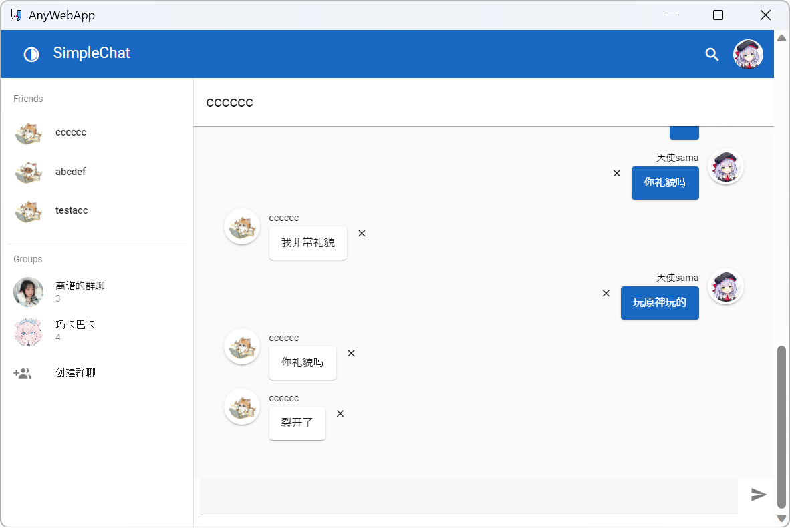

# AnyWebApp

_✨ 在没有托管 Web 服务器的情况下运行任何 Web 应用程序！✨_

---

您无需安装任何东西、编写任何脚本或进行任何复杂的配置。只需按照以下步骤，在 Windows 上运行您的 Web 应用程序作为桌面应用程序。

## 预览

此简单的应用程序是使用 [vue](https://vuejs.org/) 和 [vuetify](https://vuetifyjs.com/) 构建的，并且在 AnyWebApp 上运行良好。

## 使用方法

1. 下载最新版本。
2. 创建一个名为 `wwwroot` 的文件夹，用于存储您的 Web 应用程序资产。
3. 将您的所有 Web 应用程序资产复制到该文件夹中。
4. 启动 `AnyWebApp.exe`

## 要求

- [Microsoft Edge WebView2 Runtime](https://learn.microsoft.com/en-us/microsoft-edge/webview2/)

## 配置

启动 `AnyWebApp.exe` 后，将生成一个名为 `AppConfig.json` 的配置文件。

您可以在配置文件中指定 Web 应用程序的根目录、请求所使用的方案、默认启动 URI、窗口标题、图标、大小和缩放比率等。

## 常见问题解答

以下是关于常见问题和一些使用技巧的内容。

### 配置 Vue Router

如果您正在使用 Vue Router 并使用“history”模式，则可以进行如下配置。

1. 启动 `AnyWebApp.exe` 后，将生成一个名为 `AppConfig.json` 的配置文件。
2. 打开该配置文件，然后将 `EnableDocumentFallbackFiles` 设置为 `true`。

完成这些步骤后，当您的程序请求不存在的文档资源时，它将返回在配置文件中配置的文档，例如 `index.html`。这样，Vue Router 就可以在您的 Web 应用程序中工作了。